# Restaurant System Chen ER Diagram

```mermaid
flowchart TB
    classDef entity fill:#ffffff,stroke:#111827,stroke-width:2px,color:#111827;
    classDef attribute fill:#ffffff,stroke:#64748b,stroke-width:1px,color:#111827;
    classDef relationship fill:#fff7ed,stroke:#c2410c,stroke-width:2px,color:#7c2d12;

    %% MENU DOMAIN
    CAT[CATEGORIES]:::entity
    CAT_ID(["PK category_id"]):::attribute
    CAT_NAME(["category_name"]):::attribute
    CAT_ID --- CAT
    CAT_NAME --- CAT

    MENU[MENUS]:::entity
    MENU_ID(["PK menu_id"]):::attribute
    MENU_NAME(["menu_name"]):::attribute
    MENU_IMAGE(["menu_image"]):::attribute
    MENU_CATEGORY(["FK category_id"]):::attribute
    MENU_PRICE(["price"]):::attribute
    MENU_AVAILABLE(["availability"]):::attribute
    MENU_ID --- MENU
    MENU_NAME --- MENU
    MENU_IMAGE --- MENU
    MENU_CATEGORY --- MENU
    MENU_PRICE --- MENU
    MENU_AVAILABLE --- MENU

    RECIPE[RECIPES]:::entity
    RECIPE_ID(["PK recipe_id"]):::attribute
    RECIPE_MENU(["FK menu_id"]):::attribute
    RECIPE_ING(["FK ingredient_id"]):::attribute
    RECIPE_QTY(["quantity_used"]):::attribute
    RECIPE_UNIT(["unit"]):::attribute
    RECIPE_ID --- RECIPE
    RECIPE_MENU --- RECIPE
    RECIPE_ING --- RECIPE
    RECIPE_QTY --- RECIPE
    RECIPE_UNIT --- RECIPE

    ATTR_TYPE[ATTRIBUTE_TYPES]:::entity
    ATTR_TYPE_ID(["PK attribute_type_id"]):::attribute
    ATTR_TYPE_NAME(["type_name"]):::attribute
    ATTR_SELECTION(["selection_type"]):::attribute
    ATTR_REQUIRED(["required"]):::attribute
    ATTR_TYPE_ID --- ATTR_TYPE
    ATTR_TYPE_NAME --- ATTR_TYPE
    ATTR_SELECTION --- ATTR_TYPE
    ATTR_REQUIRED --- ATTR_TYPE

    ATTR[ATTRIBUTES]:::entity
    ATTR_ID(["PK attribute_id"]):::attribute
    ATTR_TYPE_FK(["FK attribute_type_id"]):::attribute
    ATTR_NAME(["attribute_name"]):::attribute
    ATTR_PRICE(["price_delta"]):::attribute
    ATTR_ID --- ATTR
    ATTR_TYPE_FK --- ATTR
    ATTR_NAME --- ATTR
    ATTR_PRICE --- ATTR

    MENU_ATTR[MENU_ATTRIBUTES]:::entity
    MENU_ATTR_ID(["PK menu_attribute_id"]):::attribute
    MENU_ATTR_MENU(["FK menu_id"]):::attribute
    MENU_ATTR_ATTR(["FK attribute_id"]):::attribute
    MENU_ATTR_ID --- MENU_ATTR
    MENU_ATTR_MENU --- MENU_ATTR
    MENU_ATTR_ATTR --- MENU_ATTR

    R_CAT_MENU{HAS}:::relationship
    CAT -- "1" --- R_CAT_MENU
    R_CAT_MENU -- "M" --- MENU

    R_MENU_RECIPE{HAS RECIPE}:::relationship
    MENU -- "1" --- R_MENU_RECIPE
    R_MENU_RECIPE -- "M" --- RECIPE

    R_TYPE_ATTR{GROUPS}:::relationship
    ATTR_TYPE -- "1" --- R_TYPE_ATTR
    R_TYPE_ATTR -- "M" --- ATTR

    R_MENU_MA{OFFERS}:::relationship
    MENU -- "1" --- R_MENU_MA
    R_MENU_MA -- "M" --- MENU_ATTR

    R_ATTR_MA{ASSIGNED TO}:::relationship
    ATTR -- "1" --- R_ATTR_MA
    R_ATTR_MA -- "M" --- MENU_ATTR

    %% INVENTORY DOMAIN
    SUPPLIER[SUPPLIERS]:::entity
    SUPPLIER_ID(["PK supplier_id"]):::attribute
    SUPPLIER_NAME(["supplier_name"]):::attribute
    SUPPLIER_PHONE(["phone"]):::attribute
    SUPPLIER_ID --- SUPPLIER
    SUPPLIER_NAME --- SUPPLIER
    SUPPLIER_PHONE --- SUPPLIER

    ING[INGREDIENTS]:::entity
    ING_ID(["PK ingredient_id"]):::attribute
    ING_NAME(["ingredient_name"]):::attribute
    ING_IMAGE(["ingredient_image"]):::attribute
    ING_STOCK(["stock_quantity"]):::attribute
    ING_UNIT(["unit"]):::attribute
    ING_COST(["cost_per_unit"]):::attribute
    ING_MIN(["min_thereshold"]):::attribute
    ING_SUPPLIER(["FK supplier_id"]):::attribute
    ING_ID --- ING
    ING_NAME --- ING
    ING_IMAGE --- ING
    ING_STOCK --- ING
    ING_UNIT --- ING
    ING_COST --- ING
    ING_MIN --- ING
    ING_SUPPLIER --- ING

    SUPPLY_ORDER[SUPPLY_ORDERS]:::entity
    SO_ID(["PK supply_order_id"]):::attribute
    SO_SUPPLIER(["FK supplier_id"]):::attribute
    SO_STAFF(["FK staff_id"]):::attribute
    SO_DATE(["order_date"]):::attribute
    SO_TOTAL(["total_amount"]):::attribute
    SO_STATUS(["status"]):::attribute
    SO_ID --- SUPPLY_ORDER
    SO_SUPPLIER --- SUPPLY_ORDER
    SO_STAFF --- SUPPLY_ORDER
    SO_DATE --- SUPPLY_ORDER
    SO_TOTAL --- SUPPLY_ORDER
    SO_STATUS --- SUPPLY_ORDER

    SUPPLY_DETAIL[SUPPLY_ORDER_DETAILS]:::entity
    SOD_ID(["PK supply_order_detail_id"]):::attribute
    SOD_ORDER(["FK supply_order_id"]):::attribute
    SOD_ING(["FK ingredient_id"]):::attribute
    SOD_QTY(["quantity"]):::attribute
    SOD_PRICE(["unit_price"]):::attribute
    SOD_ID --- SUPPLY_DETAIL
    SOD_ORDER --- SUPPLY_DETAIL
    SOD_ING --- SUPPLY_DETAIL
    SOD_QTY --- SUPPLY_DETAIL
    SOD_PRICE --- SUPPLY_DETAIL

    IMPORT[IMPORTS]:::entity
    IMPORT_ID(["PK import_id"]):::attribute
    IMPORT_ORDER(["FK supplier_order_id"]):::attribute
    IMPORT_DATE(["import_date"]):::attribute
    IMPORT_STAFF(["FK received_by"]):::attribute
    IMPORT_REMARK(["remark"]):::attribute
    IMPORT_ID --- IMPORT
    IMPORT_ORDER --- IMPORT
    IMPORT_DATE --- IMPORT
    IMPORT_STAFF --- IMPORT
    IMPORT_REMARK --- IMPORT

    IMPORT_DETAIL[IMPORT_DETAILS]:::entity
    ID_ID(["PK import_detail_id"]):::attribute
    ID_IMPORT(["FK import_id"]):::attribute
    ID_ING(["FK ingredient_id"]):::attribute
    ID_QTY(["received_quantity"]):::attribute
    ID_COST(["cost_price"]):::attribute
    ID_ID --- IMPORT_DETAIL
    ID_IMPORT --- IMPORT_DETAIL
    ID_ING --- IMPORT_DETAIL
    ID_QTY --- IMPORT_DETAIL
    ID_COST --- IMPORT_DETAIL

    R_SUP_ING{SUPPLIES}:::relationship
    SUPPLIER -- "1" --- R_SUP_ING
    R_SUP_ING -- "M" --- ING

    R_SUP_SO{RECEIVES}:::relationship
    SUPPLIER -- "1" --- R_SUP_SO
    R_SUP_SO -- "M" --- SUPPLY_ORDER

    R_SO_DETAIL{CONTAINS}:::relationship
    SUPPLY_ORDER -- "1" --- R_SO_DETAIL
    R_SO_DETAIL -- "M" --- SUPPLY_DETAIL

    R_ING_SOD{ORDERED IN}:::relationship
    ING -- "1" --- R_ING_SOD
    R_ING_SOD -- "M" --- SUPPLY_DETAIL

    R_SO_IMPORT{FULFILLED BY}:::relationship
    SUPPLY_ORDER -- "1" --- R_SO_IMPORT
    R_SO_IMPORT -- "M" --- IMPORT

    R_IMPORT_DETAIL{CONTAINS}:::relationship
    IMPORT -- "1" --- R_IMPORT_DETAIL
    R_IMPORT_DETAIL -- "M" --- IMPORT_DETAIL

    R_ING_IMPORT{RECEIVED AS}:::relationship
    ING -- "1" --- R_ING_IMPORT
    R_ING_IMPORT -- "M" --- IMPORT_DETAIL

    R_ING_RECIPE{USED IN}:::relationship
    ING -- "1" --- R_ING_RECIPE
    R_ING_RECIPE -- "M" --- RECIPE

    %% STAFF, TABLE, ORDER, AND SALES DOMAIN
    STAFF[STAFF]:::entity
    STAFF_ID(["PK staff_id"]):::attribute
    STAFF_FIRST(["first_name"]):::attribute
    STAFF_LAST(["last_name"]):::attribute
    STAFF_PHONE(["phone"]):::attribute
    STAFF_ROLE(["role"]):::attribute
    STAFF_USERNAME(["UK username"]):::attribute
    STAFF_PASSWORD(["password"]):::attribute
    STAFF_ID --- STAFF
    STAFF_FIRST --- STAFF
    STAFF_LAST --- STAFF
    STAFF_PHONE --- STAFF
    STAFF_ROLE --- STAFF
    STAFF_USERNAME --- STAFF
    STAFF_PASSWORD --- STAFF

    TABLES[TABLES]:::entity
    TABLE_ID(["PK table_id"]):::attribute
    TABLE_NAME(["table_name"]):::attribute
    TABLE_NUMBER(["UK table_number"]):::attribute
    TABLE_CAPACITY(["capacity"]):::attribute
    TABLE_STATUS(["status"]):::attribute
    TABLE_ID --- TABLES
    TABLE_NAME --- TABLES
    TABLE_NUMBER --- TABLES
    TABLE_CAPACITY --- TABLES
    TABLE_STATUS --- TABLES

    SESSION[SERVICE_SESSIONS]:::entity
    SESSION_ID(["PK session_id"]):::attribute
    SESSION_TYPE(["session_type"]):::attribute
    SESSION_TABLE(["FK table_id"]):::attribute
    SESSION_TABLE_NO(["table_number"]):::attribute
    SESSION_STAFF(["FK staff_id"]):::attribute
    SESSION_START(["started_at"]):::attribute
    SESSION_END(["ended_at"]):::attribute
    SESSION_STATUS(["status"]):::attribute
    SESSION_ID --- SESSION
    SESSION_TYPE --- SESSION
    SESSION_TABLE --- SESSION
    SESSION_TABLE_NO --- SESSION
    SESSION_STAFF --- SESSION
    SESSION_START --- SESSION
    SESSION_END --- SESSION
    SESSION_STATUS --- SESSION

    ORDER[ORDERS]:::entity
    ORDER_ID(["PK order_id"]):::attribute
    ORDER_SESSION(["FK session_id"]):::attribute
    ORDER_STAFF(["FK staff_id"]):::attribute
    ORDER_DATE(["ordered_at"]):::attribute
    ORDER_STATUS(["status"]):::attribute
    ORDER_ID --- ORDER
    ORDER_SESSION --- ORDER
    ORDER_STAFF --- ORDER
    ORDER_DATE --- ORDER
    ORDER_STATUS --- ORDER

    ORDER_ITEM[ORDER_ITEMS]:::entity
    OI_ID(["PK order_item_id"]):::attribute
    OI_ORDER(["FK order_id"]):::attribute
    OI_MENU(["FK menu_id"]):::attribute
    OI_QTY(["quantity"]):::attribute
    OI_NOTE(["note"]):::attribute
    OI_ID --- ORDER_ITEM
    OI_ORDER --- ORDER_ITEM
    OI_MENU --- ORDER_ITEM
    OI_QTY --- ORDER_ITEM
    OI_NOTE --- ORDER_ITEM

    SALE[SALES]:::entity
    SALE_ID(["PK sales_id"]):::attribute
    SALE_SESSION(["FK session_id"]):::attribute
    SALE_TOTAL(["total_amount"]):::attribute
    SALE_PAID(["paid_at"]):::attribute
    SALE_ID --- SALE
    SALE_SESSION --- SALE
    SALE_TOTAL --- SALE
    SALE_PAID --- SALE

    R_TABLE_SESSION{HOSTS}:::relationship
    TABLES -- "1" --- R_TABLE_SESSION
    R_TABLE_SESSION -- "M" --- SESSION

    R_STAFF_SESSION{MANAGES}:::relationship
    STAFF -- "1" --- R_STAFF_SESSION
    R_STAFF_SESSION -- "M" --- SESSION

    R_SESSION_ORDER{CONTAINS}:::relationship
    SESSION -- "1" --- R_SESSION_ORDER
    R_SESSION_ORDER -- "M" --- ORDER

    R_STAFF_ORDER{HANDLES}:::relationship
    STAFF -- "1" --- R_STAFF_ORDER
    R_STAFF_ORDER -- "M" --- ORDER

    R_ORDER_ITEM{CONTAINS}:::relationship
    ORDER -- "1" --- R_ORDER_ITEM
    R_ORDER_ITEM -- "M" --- ORDER_ITEM

    R_MENU_ITEM{SELECTED AS}:::relationship
    MENU -- "1" --- R_MENU_ITEM
    R_MENU_ITEM -- "M" --- ORDER_ITEM

    R_SESSION_SALE{PRODUCES}:::relationship
    SESSION -- "1" --- R_SESSION_SALE
    R_SESSION_SALE -- "M" --- SALE

    R_STAFF_SO{CREATES}:::relationship
    STAFF -- "1" --- R_STAFF_SO
    R_STAFF_SO -- "M" --- SUPPLY_ORDER

    R_STAFF_IMPORT{RECEIVES}:::relationship
    STAFF -- "1" --- R_STAFF_IMPORT
    R_STAFF_IMPORT -- "M" --- IMPORT
```

## Notes

- `PK` means primary key.
- `FK` means foreign key.
- `UK` means unique key.
- `1` and `M` represent one-to-many cardinality.
- `service_sessions.table_number` duplicates information available through `table_id` and can be removed after all APIs use `table_id`.
- `imports.supplier_order_id` references `supply_orders.supply_order_id`; renaming it to `supply_order_id` would make naming consistent.
